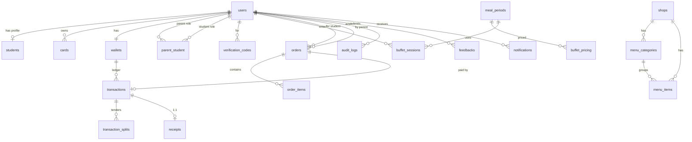

# UPOS — Dulwich School Canteen System Design

> **Doc**: System Design Specification
> **Project**: Dulwich School — UPOS (Unified Point of Sale)
> **Stack**: Bun + Elysia + TypeScript (backend) · Vue 3 + Vite (frontend) · PostgreSQL · Redis
> **Author**: System Architect
> **Status**: Draft v1.0 (based on Sodexo/Okontek Requirement signed 7/4/2026)

---

## สารบัญ

1. [System Overview & Architecture](#1-system-overview--architecture)
2. [Database Design](#2-database-design)
3. [API Design](#3-api-design)
4. [User Roles & Permissions](#4-user-roles--permissions)
5. [User Flows](#5-user-flows)
6. [UX/UI Design](#6-uxui-design)
7. [Business Logic](#7-business-logic)
8. [Edge Cases & Error Handling](#8-edge-cases--error-handling)
9. [Non-functional Requirements](#9-non-functional-requirements)
10. [Tech Stack](#10-tech-stack)
11. [Development Breakdown](#11-development-breakdown)
12. [Appendix — ข้อเสนอแนะปรับ Requirement](#12-appendix--ข้อเสนอแนะปรับ-requirement)

---

## Assumptions (จาก Requirement + red annotations + ที่ confirm)

| # | ประเด็น | สรุป |
|---|---|---|
| 1 | Pre-order scope | เริ่มต้น K1–K2 เท่านั้น แต่ DB/Logic ออกแบบเป็น `eligible_grade_levels` (ขยายในอนาคตได้) |
| 2 | Parent ↔ Student | M:N — 1 Parent มีลูกหลายคน, 1 Student มีผู้ปกครองหลายคน |
| 3 | Card lifecycle | เปลี่ยนบัตรได้ ข้อมูล/ยอดคงเดิม — บัตรเก่า status = `inactive` |
| 4 | Buffet | จ่ายผ่าน wallet / Payment Gateway / Coupon · กินอีกรอบ = หักเงินใหม่ (per round) · กันแตะซ้ำในรอบเดียว |
| 5 | POS Purchase | จ่ายผสมหลายช่องทาง (multi-tender: หลายบัตร + cash + QR) |
| 6 | Verification Code | อายุ 14 วัน |
| 7 | Reporting | ย้อนหลังได้ ≥ 1 เดือน · พิมพ์ใบเสร็จย้อนหลัง + ออกใบกำกับภาษีได้ |
| 8 | Negative balance | default −100฿ · เตือนเมื่อยอด < 200฿ · ตั้งค่าได้โดย Admin |
| 9 | Payment Gateway | SCB Easy (PromptPay QR, Credit Card, Alipay, WeChat) |
| 10 | Hardware | Kiosk × 1, POS Canteen × 2, POS Cafe × 1 |

---

## 1. System Overview & Architecture

### 1.1 ภาพรวม

ระบบ UPOS เป็น **Cashless Canteen Platform** สำหรับ Dulwich School ทำงานบน Cloud รองรับ 4 หน้าจอผู้ใช้งาน:

- **Parent Mobile Web** — เติมเงิน, Pre-order, ดูประวัติ
- **Admin Web Portal** — จัดการ user/menu/policy/report
- **POS Terminal** (Vue + Electron) — ขายหน้าร้าน · รับ Pre-order · Buffet entry
- **Kiosk Self-Service** — ตรวจยอด · เติมเงิน QR · พิมพ์ใบเสร็จ · feedback

### 1.2 High-level Architecture

```
                ┌───────────────────────────────────────────────────────────┐
                │                  CLIENT LAYER (Vue 3)                       │
                │  Parent Web | Admin Portal | POS (Electron) | Kiosk PWA   │
                └──────────────────────────┬─────────────────────────────────┘
                                           │  HTTPS / WebSocket
                                           ▼
        ┌─────────────────────────────────────────────────────────────────┐
        │            API GATEWAY (Elysia / Bun) — JWT + RBAC              │
        │     Rate-limit · Request log · CORS · Idempotency-Key           │
        └──┬───────────┬───────────┬───────────┬──────────────┬───────────┘
           │           │           │           │              │
           ▼           ▼           ▼           ▼              ▼
       ┌──────┐   ┌────────┐  ┌────────┐  ┌────────┐    ┌──────────┐
       │Auth  │   │Wallet  │  │Order   │  │Buffet  │    │Report/   │
       │Svc   │   │Svc     │  │Svc     │  │Svc     │    │Audit Svc │
       └──┬───┘   └───┬────┘  └───┬────┘  └───┬────┘    └────┬─────┘
          │           │           │           │              │
          ▼           ▼           ▼           ▼              ▼
        ┌────────────────────────────────────────────────────────┐
        │           PostgreSQL (primary)  +  Read replica         │
        └────────────────────────────────────────────────────────┘
                  │                  │                  │
                  ▼                  ▼                  ▼
            ┌─────────┐       ┌─────────────┐   ┌─────────────┐
            │  Redis  │       │   BullMQ    │   │  S3/MinIO   │
            │ cache/  │       │  jobs/queue │   │  receipts   │
            │ session │       │ notify/sync │   │   /images   │
            └─────────┘       └─────────────┘   └─────────────┘

  External:
    ↘ SCB Payment Gateway (PromptPay/QR/CC/Alipay/WeChat)
    ↘ School Student Database (sync via API/cron)
    ↘ Email (SendGrid/SES) · SMS (TwilSMS)
    ↘ Receipt Printer (ESC/POS), RFID Reader (PC/SC via local agent)
```

### 1.3 Deployment topology

| Component | Where |
|---|---|
| Backend API | Containerized (Docker) บน K8s/ECS — 2 replicas min |
| DB | Managed Postgres (RDS/Cloud SQL) + daily snapshot |
| Cache/Queue | Managed Redis |
| Storage | S3/MinIO — receipt PDFs, menu images |
| CDN | CloudFront / Cloudflare — static + image |
| POS app | Electron build (Windows) + auto-update channel |
| Kiosk | Chrome kiosk-mode PWA — auto reload daily |

### 1.4 Environments

| Env | Purpose | Data |
|---|---|---|
| DEV | นักพัฒนา | mock |
| SIT | Integration | seeded |
| UAT | Customer test | masked prod-like |
| PROD | Live | real |

---

## 2. Database Design

### 2.1 ER Overview (เชิงข้อความ)

- **User** เป็น root ของทุก role (student/parent/teacher/visitor/cashier/supervisor/admin)
- **Student** ↔ **Parent** เป็น **M:N** ผ่าน `parent_student` (รองรับลูกหลายคน, ผู้ปกครองหลายคน)
- **Card** ผูกกับ User (1 user มีหลายบัตรตามเวลา — บัตรเก่า inactive)
- **Wallet** 1:1 กับ User (ทุกประเภท user มี wallet เป็นของตัวเอง — student ใช้ของตัวเอง, parent topup ให้ student)
- **Transaction** เป็น immutable ledger — purchase/topup/void/refund อ้างถึง wallet
- **Order** (pre-order) → มี `order_items` → redeem ที่ POS เปลี่ยนสถานะเป็น `redeemed`
- **BuffetSession** บันทึก check-in (user + meal_period + date) — unique constraint กันซ้ำในรอบ
- **MealPeriod** กำหนดรอบเวลา (Breakfast / Lunch / Dinner) + cut-off
- **MenuItem** มี shop, category, available time window, daily_quota
- **AuditLog** เก็บทุก policy/void/admin action — append-only

### 2.2 Tables Schema

#### 2.2.1 Users & Identity

```sql
-- ผู้ใช้ทุกประเภท (rollup)
CREATE TABLE users (
  id              UUID PRIMARY KEY DEFAULT gen_random_uuid(),
  uid             VARCHAR(32) UNIQUE NOT NULL,        -- Student UID / Staff ID / Visitor code
  role            VARCHAR(20) NOT NULL CHECK (role IN
                  ('student','parent','teacher','staff','visitor','cashier','supervisor','admin')),
  email           VARCHAR(120),
  phone           VARCHAR(20),
  password_hash   VARCHAR(255),                       -- null สำหรับ student/visitor ที่ไม่ login
  first_name      VARCHAR(80) NOT NULL,
  last_name       VARCHAR(80) NOT NULL,
  display_name    VARCHAR(160),
  avatar_url      TEXT,
  status          VARCHAR(20) NOT NULL DEFAULT 'active'
                  CHECK (status IN ('active','inactive','suspended')),
  pdpa_accepted_at TIMESTAMPTZ,
  created_at      TIMESTAMPTZ NOT NULL DEFAULT NOW(),
  updated_at      TIMESTAMPTZ NOT NULL DEFAULT NOW()
);
CREATE INDEX idx_users_role        ON users(role);
CREATE INDEX idx_users_status      ON users(status);
CREATE UNIQUE INDEX idx_users_email_lower ON users(LOWER(email)) WHERE email IS NOT NULL;
CREATE UNIQUE INDEX idx_users_phone ON users(phone) WHERE phone IS NOT NULL;

-- ข้อมูลเฉพาะนักเรียน
CREATE TABLE students (
  user_id         UUID PRIMARY KEY REFERENCES users(id) ON DELETE RESTRICT,
  grade_level     VARCHAR(8) NOT NULL,                -- 'K1','K2','P1'..'P6','S1'..'S6'
  class_name      VARCHAR(40),                        -- 'K1-A'
  dob             DATE,
  guardian_email  VARCHAR(120),                       -- email หลักของผู้ปกครอง (สำหรับส่ง code)
  promoted_at     TIMESTAMPTZ
);
CREATE INDEX idx_students_grade ON students(grade_level);

-- M:N Parent ↔ Student
CREATE TABLE parent_student (
  id              UUID PRIMARY KEY DEFAULT gen_random_uuid(),
  parent_user_id  UUID NOT NULL REFERENCES users(id) ON DELETE CASCADE,
  student_user_id UUID NOT NULL REFERENCES users(id) ON DELETE CASCADE,
  relationship    VARCHAR(20) DEFAULT 'parent',       -- parent/guardian/grandparent
  is_primary      BOOLEAN NOT NULL DEFAULT FALSE,
  bound_at        TIMESTAMPTZ NOT NULL DEFAULT NOW(),
  UNIQUE (parent_user_id, student_user_id)
);
CREATE INDEX idx_ps_parent  ON parent_student(parent_user_id);
CREATE INDEX idx_ps_student ON parent_student(student_user_id);

-- รหัส verification (registration / link parent–student) — 14 วัน
CREATE TABLE verification_codes (
  id              UUID PRIMARY KEY DEFAULT gen_random_uuid(),
  student_user_id UUID NOT NULL REFERENCES users(id) ON DELETE CASCADE,
  code_hash       VARCHAR(255) NOT NULL,              -- hash, ไม่เก็บ plain
  purpose         VARCHAR(40) NOT NULL,               -- 'parent_register','link_additional'
  sent_to_email   VARCHAR(120),
  expires_at      TIMESTAMPTZ NOT NULL,               -- = created_at + 14 days
  used_at         TIMESTAMPTZ,
  attempts        SMALLINT NOT NULL DEFAULT 0,
  created_at      TIMESTAMPTZ NOT NULL DEFAULT NOW()
);
CREATE INDEX idx_vc_student   ON verification_codes(student_user_id);
CREATE INDEX idx_vc_active    ON verification_codes(expires_at) WHERE used_at IS NULL;
```

#### 2.2.2 Cards

```sql
CREATE TABLE cards (
  id              UUID PRIMARY KEY DEFAULT gen_random_uuid(),
  card_uid        VARCHAR(64) UNIQUE NOT NULL,        -- ค่าใน RFID/NFC chip
  user_id         UUID NOT NULL REFERENCES users(id) ON DELETE RESTRICT,
  card_type       VARCHAR(20) NOT NULL CHECK (card_type IN
                  ('student','staff','visitor_temp')),
  status          VARCHAR(20) NOT NULL DEFAULT 'active'
                  CHECK (status IN ('active','inactive','lost')),
  issued_at       TIMESTAMPTZ NOT NULL DEFAULT NOW(),
  deactivated_at  TIMESTAMPTZ,
  reason          VARCHAR(200)                        -- เหตุผลที่ inactive (เปลี่ยนบัตร/หาย)
);
CREATE INDEX idx_cards_user        ON cards(user_id);
CREATE INDEX idx_cards_active      ON cards(user_id) WHERE status='active';
-- กฎ: user 1 คนมี active card ได้แค่ใบเดียว — บังคับใน app layer + partial unique
CREATE UNIQUE INDEX idx_cards_one_active_per_user
  ON cards(user_id) WHERE status='active';
```

#### 2.2.3 Wallet & Transactions

```sql
CREATE TABLE wallets (
  id              UUID PRIMARY KEY DEFAULT gen_random_uuid(),
  user_id         UUID UNIQUE NOT NULL REFERENCES users(id) ON DELETE RESTRICT,
  balance         NUMERIC(12,2) NOT NULL DEFAULT 0,
  negative_limit  NUMERIC(12,2) NOT NULL DEFAULT 100, -- ติดลบได้ 100 บาท (override ได้)
  low_threshold   NUMERIC(12,2) NOT NULL DEFAULT 200, -- เตือนเมื่อต่ำกว่า
  currency        CHAR(3) NOT NULL DEFAULT 'THB',
  updated_at      TIMESTAMPTZ NOT NULL DEFAULT NOW(),
  version         INT NOT NULL DEFAULT 0              -- optimistic lock
);
CREATE INDEX idx_wallets_user ON wallets(user_id);

-- Ledger — immutable
CREATE TABLE transactions (
  id              UUID PRIMARY KEY DEFAULT gen_random_uuid(),
  ref_no          VARCHAR(40) UNIQUE NOT NULL,        -- TXN20260801-000123 (มนุษย์อ่าน)
  wallet_id       UUID NOT NULL REFERENCES wallets(id),
  type            VARCHAR(20) NOT NULL CHECK (type IN
                  ('topup','purchase','buffet','refund','void','adjustment')),
  amount          NUMERIC(12,2) NOT NULL,             -- + เข้า / − ออก
  balance_after   NUMERIC(12,2) NOT NULL,
  channel         VARCHAR(20) NOT NULL CHECK (channel IN
                  ('pos','kiosk','mobile_web','admin','system')),
  payment_method  VARCHAR(20),                        -- card_wallet, scb_qr, credit_card, alipay, wechat, cash, coupon, gateway
  payment_ref     VARCHAR(80),                        -- gateway transaction id
  device_id       VARCHAR(40),
  cashier_id      UUID REFERENCES users(id),
  related_order_id UUID,                              -- FK orders
  related_buffet_id UUID,                             -- FK buffet_sessions
  voided_by_txn_id UUID REFERENCES transactions(id),  -- if voided
  status          VARCHAR(20) NOT NULL DEFAULT 'success'
                  CHECK (status IN ('pending','success','failed','voided')),
  note            TEXT,
  metadata        JSONB,                              -- flexible: gateway raw, etc.
  created_at      TIMESTAMPTZ NOT NULL DEFAULT NOW()
);
CREATE INDEX idx_txn_wallet_date ON transactions(wallet_id, created_at DESC);
CREATE INDEX idx_txn_type_date   ON transactions(type, created_at DESC);
CREATE INDEX idx_txn_status      ON transactions(status);
CREATE INDEX idx_txn_payment_ref ON transactions(payment_ref) WHERE payment_ref IS NOT NULL;

-- Multi-tender split (รองรับ "จ่ายด้วยบัตรหลายใบ / ผสมหลายช่อง")
CREATE TABLE transaction_splits (
  id              UUID PRIMARY KEY DEFAULT gen_random_uuid(),
  transaction_id  UUID NOT NULL REFERENCES transactions(id) ON DELETE CASCADE,
  tender_method   VARCHAR(20) NOT NULL,               -- card_wallet, scb_qr, cash, coupon, ...
  source_wallet_id UUID REFERENCES wallets(id),       -- ถ้าจ่ายจาก wallet/หลายบัตร
  amount          NUMERIC(12,2) NOT NULL,
  ref             VARCHAR(80)
);
CREATE INDEX idx_txn_splits ON transaction_splits(transaction_id);
```

#### 2.2.4 Menu & Shops

```sql
CREATE TABLE shops (
  id              UUID PRIMARY KEY DEFAULT gen_random_uuid(),
  code            VARCHAR(20) UNIQUE NOT NULL,        -- 'BUFFET','CAFE','SHOP_A'
  name            VARCHAR(80) NOT NULL,
  type            VARCHAR(20) NOT NULL CHECK (type IN ('buffet','a_la_carte','mixed')),
  active          BOOLEAN DEFAULT TRUE
);

CREATE TABLE menu_categories (
  id              UUID PRIMARY KEY DEFAULT gen_random_uuid(),
  shop_id         UUID NOT NULL REFERENCES shops(id) ON DELETE CASCADE,
  name            VARCHAR(80) NOT NULL,
  sort_order      INT DEFAULT 0
);

CREATE TABLE menu_items (
  id              UUID PRIMARY KEY DEFAULT gen_random_uuid(),
  shop_id         UUID NOT NULL REFERENCES shops(id) ON DELETE RESTRICT,
  category_id     UUID REFERENCES menu_categories(id),
  sku             VARCHAR(40) UNIQUE NOT NULL,
  name            VARCHAR(120) NOT NULL,
  description     TEXT,
  price           NUMERIC(10,2) NOT NULL,
  image_url       TEXT,
  daily_quota     INT,                                -- จำนวนเมนูต่อวัน
  available_from  TIME,                               -- ช่วงเวลาเสิร์ฟ
  available_to    TIME,
  active          BOOLEAN DEFAULT TRUE,
  is_preorderable BOOLEAN DEFAULT FALSE,
  created_at      TIMESTAMPTZ NOT NULL DEFAULT NOW()
);
CREATE INDEX idx_menu_shop_active ON menu_items(shop_id, active);
CREATE INDEX idx_menu_preorder    ON menu_items(is_preorderable, active);
```

#### 2.2.5 Buffet Sessions & Meal Periods

```sql
CREATE TABLE meal_periods (
  id              UUID PRIMARY KEY DEFAULT gen_random_uuid(),
  code            VARCHAR(20) UNIQUE NOT NULL,        -- 'BREAKFAST','LUNCH','DINNER'
  name            VARCHAR(60) NOT NULL,
  start_time      TIME NOT NULL,
  end_time        TIME NOT NULL,
  cutoff_minutes  INT NOT NULL DEFAULT 180,           -- 3 ชม. ก่อน start = pre-order cutoff
  seat_capacity   INT,
  active          BOOLEAN DEFAULT TRUE
);

-- ราคา buffet ตามกลุ่ม (Primary/Secondary/Staff) + meal period
CREATE TABLE buffet_pricing (
  id              UUID PRIMARY KEY DEFAULT gen_random_uuid(),
  user_group      VARCHAR(20) NOT NULL CHECK (user_group IN
                  ('primary','secondary','staff','visitor')),
  meal_period_id  UUID REFERENCES meal_periods(id),   -- null = ทุกรอบ
  price           NUMERIC(10,2) NOT NULL,
  effective_from  DATE NOT NULL,
  effective_to    DATE,
  UNIQUE (user_group, meal_period_id, effective_from)
);

-- การเข้าใช้ buffet — กันแตะซ้ำในรอบเดียว
CREATE TABLE buffet_sessions (
  id              UUID PRIMARY KEY DEFAULT gen_random_uuid(),
  user_id         UUID NOT NULL REFERENCES users(id),
  meal_period_id  UUID NOT NULL REFERENCES meal_periods(id),
  entry_date      DATE NOT NULL,                      -- วันที่ (ไม่ใช่ timestamp)
  price_charged   NUMERIC(10,2) NOT NULL,
  pay_method      VARCHAR(20) NOT NULL,               -- 'wallet','gateway','coupon'
  transaction_id  UUID REFERENCES transactions(id),
  entered_at      TIMESTAMPTZ NOT NULL DEFAULT NOW(),
  device_id       VARCHAR(40)
);
-- กฎ: 1 user / 1 รอบ / 1 วัน = หักครั้งเดียว (ป้องกันแตะซ้ำในรอบ)
CREATE UNIQUE INDEX idx_buffet_one_per_period
  ON buffet_sessions(user_id, meal_period_id, entry_date);
CREATE INDEX idx_buffet_date  ON buffet_sessions(entry_date);
```

#### 2.2.6 Pre-Order

```sql
CREATE TABLE orders (
  id              UUID PRIMARY KEY DEFAULT gen_random_uuid(),
  order_no        VARCHAR(40) UNIQUE NOT NULL,        -- ORD20260801-000123
  student_user_id UUID NOT NULL REFERENCES users(id),
  parent_user_id  UUID REFERENCES users(id),          -- ผู้สั่ง
  shop_id         UUID NOT NULL REFERENCES shops(id),
  meal_period_id  UUID NOT NULL REFERENCES meal_periods(id),
  serve_date      DATE NOT NULL,
  total_amount    NUMERIC(10,2) NOT NULL,
  status          VARCHAR(20) NOT NULL DEFAULT 'confirmed'
                  CHECK (status IN ('pending_payment','confirmed','redeemed','cancelled','expired')),
  redeemed_at     TIMESTAMPTZ,
  redeemed_by_cashier_id UUID REFERENCES users(id),
  cancelled_at    TIMESTAMPTZ,
  cancel_reason   TEXT,
  override_reason TEXT,                               -- ถ้าเกิน cutoff โดน override
  override_by     UUID REFERENCES users(id),
  transaction_id  UUID REFERENCES transactions(id),   -- payment txn
  created_at      TIMESTAMPTZ NOT NULL DEFAULT NOW()
);
CREATE INDEX idx_orders_student_date ON orders(student_user_id, serve_date);
CREATE INDEX idx_orders_serve_status ON orders(serve_date, status);
CREATE INDEX idx_orders_status       ON orders(status);

CREATE TABLE order_items (
  id              UUID PRIMARY KEY DEFAULT gen_random_uuid(),
  order_id        UUID NOT NULL REFERENCES orders(id) ON DELETE CASCADE,
  menu_item_id    UUID NOT NULL REFERENCES menu_items(id),
  qty             INT NOT NULL DEFAULT 1,
  unit_price      NUMERIC(10,2) NOT NULL,
  line_total      NUMERIC(10,2) NOT NULL,
  note            TEXT
);
```

#### 2.2.7 POS Receipts & Invoice

```sql
CREATE TABLE receipts (
  id              UUID PRIMARY KEY DEFAULT gen_random_uuid(),
  receipt_no      VARCHAR(40) UNIQUE NOT NULL,        -- RCP20260801-000123
  transaction_id  UUID NOT NULL UNIQUE REFERENCES transactions(id),
  printed_count   INT NOT NULL DEFAULT 0,
  pdf_url         TEXT,                               -- S3
  tax_invoice_no  VARCHAR(40) UNIQUE,                 -- ใบกำกับภาษี (ถ้าออก)
  tax_invoice_customer JSONB,                         -- ชื่อ/ที่อยู่/เลขผู้เสียภาษี
  tax_invoice_issued_at TIMESTAMPTZ,
  created_at      TIMESTAMPTZ NOT NULL DEFAULT NOW()
);
CREATE INDEX idx_receipts_txn ON receipts(transaction_id);
```

#### 2.2.8 Policy & Audit

```sql
CREATE TABLE policies (
  key             VARCHAR(60) PRIMARY KEY,            -- 'negative_balance_limit','low_balance_threshold'
  value           JSONB NOT NULL,
  description     TEXT,
  updated_by      UUID REFERENCES users(id),
  updated_at      TIMESTAMPTZ NOT NULL DEFAULT NOW()
);

CREATE TABLE audit_logs (
  id              BIGSERIAL PRIMARY KEY,
  actor_user_id   UUID REFERENCES users(id),
  actor_role      VARCHAR(20),
  action          VARCHAR(60) NOT NULL,               -- 'login','topup','void_txn','policy_change'
  entity_type     VARCHAR(40),
  entity_id       VARCHAR(64),
  ip              INET,
  user_agent      TEXT,
  before_data     JSONB,
  after_data      JSONB,
  reason          TEXT,
  created_at      TIMESTAMPTZ NOT NULL DEFAULT NOW()
);
CREATE INDEX idx_audit_actor_date ON audit_logs(actor_user_id, created_at DESC);
CREATE INDEX idx_audit_action     ON audit_logs(action);
CREATE INDEX idx_audit_entity     ON audit_logs(entity_type, entity_id);
-- ห้าม delete (enforce ผ่าน DB role + revoke DELETE)
```

#### 2.2.9 Feedback & Notifications

```sql
CREATE TABLE feedbacks (
  id              UUID PRIMARY KEY DEFAULT gen_random_uuid(),
  user_id         UUID REFERENCES users(id),          -- null = anonymous (kiosk)
  channel         VARCHAR(20) NOT NULL CHECK (channel IN ('kiosk','mobile')),
  rating          SMALLINT CHECK (rating BETWEEN 1 AND 5),
  category        VARCHAR(40),                        -- 'food','service','cleanliness'
  comment         TEXT,
  shop_id         UUID REFERENCES shops(id),
  order_id        UUID REFERENCES orders(id),         -- parent ให้ feedback เฉพาะของลูกตัวเอง
  created_at      TIMESTAMPTZ NOT NULL DEFAULT NOW()
);
CREATE INDEX idx_feedback_date ON feedbacks(created_at DESC);

CREATE TABLE notifications (
  id              UUID PRIMARY KEY DEFAULT gen_random_uuid(),
  user_id         UUID NOT NULL REFERENCES users(id),
  type            VARCHAR(40) NOT NULL,               -- 'low_balance','topup_success','order_confirmed'
  channel         VARCHAR(20) NOT NULL,               -- 'email','sms','push','in_app'
  title           VARCHAR(120),
  body            TEXT,
  payload         JSONB,
  read_at         TIMESTAMPTZ,
  sent_at         TIMESTAMPTZ,
  status          VARCHAR(20) DEFAULT 'queued'
                  CHECK (status IN ('queued','sent','failed','read')),
  created_at      TIMESTAMPTZ NOT NULL DEFAULT NOW()
);
CREATE INDEX idx_notif_user_unread ON notifications(user_id) WHERE read_at IS NULL;
```

### 2.3 ER Diagram (Mermaid)



### 2.4 Indexing Strategy (สรุป)

| Pattern | Index |
|---|---|
| ค้น user ตาม email/phone | partial unique (lower email) |
| List txn ของ wallet ล่าสุด | `(wallet_id, created_at DESC)` |
| Report ตามวัน/ช่วงเวลา | `(created_at, type)` + partial |
| กัน buffet entry ซ้ำ | unique `(user_id, meal_period_id, entry_date)` |
| Card active per user | partial unique `WHERE status='active'` |
| Audit เรียงเวลา | BRIN on `created_at` (table ใหญ่) |

### 2.5 Sample Data

```sql
-- Users
INSERT INTO users (id, uid, role, first_name, last_name, email) VALUES
('11111111-1111-1111-1111-111111111111','STD-K1-0001','student','Somying','Jaidee', NULL),
('22222222-2222-2222-2222-222222222222','PRT-0001','parent','Suchart','Jaidee','suchart@example.com'),
('33333333-3333-3333-3333-333333333333','STF-001','teacher','Anna','Brown','anna@dulwich.ac.th'),
('44444444-4444-4444-4444-444444444444','CSH-001','cashier','Nong','Cashier','nong@school.local'),
('55555555-5555-5555-5555-555555555555','SUP-001','supervisor','Patcha','Manager', NULL),
('66666666-6666-6666-6666-666666666666','ADM-001','admin','Admin','One','admin@dulwich.ac.th');

INSERT INTO students (user_id, grade_level, class_name, guardian_email) VALUES
('11111111-1111-1111-1111-111111111111','K1','K1-A','suchart@example.com');

INSERT INTO parent_student (parent_user_id, student_user_id, is_primary) VALUES
('22222222-2222-2222-2222-222222222222','11111111-1111-1111-1111-111111111111', TRUE);

-- Cards
INSERT INTO cards (card_uid, user_id, card_type) VALUES
('04A3B5C6D7E8F9','11111111-1111-1111-1111-111111111111','student'),
('04AAAA111111','33333333-3333-3333-3333-333333333333','staff');

-- Wallets
INSERT INTO wallets (user_id, balance) VALUES
('11111111-1111-1111-1111-111111111111', 850.00),
('22222222-2222-2222-2222-222222222222', 0.00),
('33333333-3333-3333-3333-333333333333', 320.00);

-- Meal periods + buffet pricing
INSERT INTO meal_periods (code,name,start_time,end_time,cutoff_minutes,seat_capacity) VALUES
('BREAKFAST','Breakfast','07:30','09:00',180,200),
('LUNCH','Lunch','11:30','13:30',180,300),
('DINNER','Dinner','17:00','18:30',180,150);

INSERT INTO buffet_pricing (user_group, meal_period_id, price, effective_from) VALUES
('primary',   NULL, 170, '2026-08-01'),
('secondary', NULL, 150, '2026-08-01'),
('staff',     NULL, 150, '2026-08-01');

-- Shops + menu
INSERT INTO shops (id, code, name, type) VALUES
('aaaa0001-0000-0000-0000-000000000001','BUFFET','Canteen Buffet','buffet'),
('aaaa0002-0000-0000-0000-000000000002','CAFE','Cafe Corner','a_la_carte');

INSERT INTO menu_items (shop_id, sku, name, price, is_preorderable) VALUES
('aaaa0002-0000-0000-0000-000000000002','LATTE','Latte', 65.00, FALSE),
('aaaa0002-0000-0000-0000-000000000002','SAND-HAM','Ham Sandwich', 85.00, TRUE);

-- Sample transaction (topup)
INSERT INTO transactions (ref_no, wallet_id, type, amount, balance_after, channel, payment_method, payment_ref)
SELECT 'TXN20260801-000001', w.id, 'topup', 1000.00, 1850.00, 'mobile_web','scb_qr','SCB-RAW-001'
FROM wallets w WHERE w.user_id='11111111-1111-1111-1111-111111111111';
```

---

## 3. API Design

REST + JSON · base URL `https://api.upos.dulwich.local/v1` · ทุก endpoint ต้อง `Authorization: Bearer <jwt>` ยกเว้น `/auth/*` และ `/health`

### 3.1 Authentication & Authorization

- **JWT (access 15 นาที + refresh 7 วัน)** เก็บใน HttpOnly cookie สำหรับ Web, body สำหรับ POS/Kiosk
- **RBAC** — role embedded ใน JWT claims · check ใน middleware
- **MFA**: Supervisor ต้องใส่ Supervisor PIN ก่อนทำ Void/Refund (step-up auth)
- **Device binding**: POS/Kiosk register device_id + secret ครั้งแรก
- **Rate limiting**: 60 req/min ต่อ IP, 10 req/min สำหรับ `/auth/login`
- **Idempotency-Key** header สำหรับ POST ที่เกี่ยวเงิน (topup, purchase) — กันยิงซ้ำ

#### 3.1.1 Endpoints — Auth

```
POST /auth/register/parent
POST /auth/verify-otp
POST /auth/verify-student-code
POST /auth/login
POST /auth/refresh
POST /auth/logout
POST /auth/pos/device-login            # POS/Kiosk login
POST /auth/supervisor-pin              # step-up
```

**Example — Parent Register**

```http
POST /auth/register/parent
Content-Type: application/json

{
  "email": "suchart@example.com",
  "phone": "0812345678",
  "password": "S3cure!P@ss",
  "first_name": "Suchart",
  "last_name": "Jaidee",
  "pdpa_accepted": true,
  "student_uid": "STD-K1-0001",
  "verification_code": "AB12CD"
}
```

Response 201:
```json
{
  "user_id": "22222222-...",
  "parent_student_id": "...",
  "next": "send_otp"
}
```

Errors:
- `400 PDPA_NOT_ACCEPTED`
- `404 STUDENT_NOT_FOUND`
- `409 STUDENT_ALREADY_BOUND` (เฉพาะ strict mode — ปกติให้ผูกได้หลายคน)
- `410 CODE_EXPIRED`
- `422 CODE_INVALID`

### 3.2 User & Profile

```
GET    /me
GET    /me/children                       # parent only
GET    /users/:id
PATCH  /users/:id
POST   /users/:id/cards                   # ออกบัตรใหม่ (admin/cashier)
PATCH  /cards/:id/deactivate
GET    /users/search?q=...                # staff/admin
```

### 3.3 Wallet

```
GET   /wallets/me
GET   /wallets/:user_id                   # self or parent of student
GET   /wallets/:user_id/transactions?limit=10&before=<txn_id>
POST  /wallets/:user_id/topup             # idempotent
```

**Topup request**

```http
POST /wallets/11111111-.../topup
Idempotency-Key: 8f7e6d-...
Authorization: Bearer <parent jwt>

{
  "amount": 1000.00,
  "channel": "mobile_web",
  "payment_method": "scb_qr"
}
```

Response 200:
```json
{
  "transaction": {
    "ref_no": "TXN20260801-000123",
    "status": "pending",
    "qr_payload": "00020101021129370016A000000677010111...",
    "expires_at": "2026-08-01T12:35:00Z"
  }
}
```

Webhook from SCB → `POST /webhooks/scb/payment` → marks `success` + updates wallet (single transaction).

### 3.4 Pre-Order

```
GET   /menu?shop=CAFE&date=2026-08-05&preorderable=true
GET   /orders/available-slots?date=2026-08-05&meal=LUNCH
POST  /orders                             # parent creates
GET   /orders?student=...&from=...&to=...
GET   /orders/:id
PATCH /orders/:id/cancel
POST  /orders/:id/redeem                  # POS scan card → redeem
POST  /orders/:id/override                # admin: หลัง cutoff
```

**Create order**

```http
POST /orders
Idempotency-Key: ...
{
  "student_user_id": "11111111-...",
  "shop_id": "aaaa0002-...",
  "meal_period_id": "<lunch>",
  "serve_date": "2026-08-05",
  "items": [
    { "menu_item_id": "<sand-ham>", "qty": 1, "note": "no mayo" }
  ],
  "pay_method": "wallet"
}
```

Validation:
- `serve_date ≥ today`, ≤ today+7
- `now < serve_date_at_period_start − cutoff_minutes`
- `wallet.balance − total ≥ −negative_limit`
- `seat capacity check`

### 3.5 POS / Buffet

```
POST /pos/card-read                     # body: { card_uid } → return user_id + balance
POST /pos/sale                          # walk-in purchase
POST /pos/buffet/check-in
POST /pos/sale/:txn_id/void             # need supervisor PIN
POST /pos/refund                        # supervisor/admin
GET  /pos/active-period                 # what meal period now?
```

**Sale request (multi-tender)**

```http
POST /pos/sale
Idempotency-Key: ...
{
  "shop_id": "aaaa0002-...",
  "cashier_id": "<cashier user_id>",
  "items": [
    { "menu_item_id": "<latte>", "qty": 2, "unit_price": 65 }
  ],
  "tenders": [
    { "method": "card_wallet", "card_uid": "04A3B5C6D7E8F9", "amount": 80 },
    { "method": "cash",        "amount": 50 }
  ],
  "want_tax_invoice": false
}
```

Response:
```json
{
  "transaction": { "ref_no": "TXN20260801-000456", "status": "success", "balance_after": 770 },
  "receipt_no": "RCP20260801-000456"
}
```

**Buffet check-in**

```http
POST /pos/buffet/check-in
{ "card_uid": "04A3B5C6D7E8F9", "meal_period_id": "<lunch>", "pay_method": "wallet" }
```

Server logic (atomic):
1. Resolve card → user (+ group)
2. Lookup price (group × period)
3. Check `buffet_sessions UNIQUE (user, period, today)` → if exists → `409 ALREADY_ENTERED`
4. Wallet check + negative-limit
5. Insert transaction + buffet_session ใน single DB tx
6. Return `{ allow_entry: true, price, balance_after }`

### 3.6 Admin / Reports

```
GET  /reports/sales?from=&to=&shop=&export=excel
GET  /reports/topup?from=&to=
GET  /reports/preorder?from=&to=
GET  /reports/buffet?from=&to=
GET  /reports/best-sellers?month=2026-08&shop=&category=
GET  /audit-logs?actor=&action=&from=&to=
PATCH /policies/:key
GET  /menu-management/items
POST /menu-management/items
PATCH /menu-management/items/:id
```

### 3.7 Feedback

```
POST /feedback                          # anonymous allowed for kiosk
GET  /feedback?shop=&from=&to=          # admin/supervisor
```

### 3.8 Error Format (RFC 7807-ish)

```json
{
  "error": {
    "code": "INSUFFICIENT_BALANCE",
    "message": "ยอดเงินไม่พอ",
    "details": { "required": 65, "available": 30, "limit": 100 },
    "trace_id": "abc-123"
  }
}
```

Standard HTTP codes + business code in body. ทุก error log + return trace_id.

---

## 4. User Roles & Permissions

### 4.1 Roles

| Role | Channels | Authen |
|---|---|---|
| Student | POS (tap card), Kiosk | Card UID |
| Parent | Mobile Web | Email/Phone + OTP |
| Teacher/Staff | POS, Mobile Web | Staff ID / Email |
| Visitor | POS | Temp card |
| Cashier | POS | Username + PIN |
| Supervisor | POS, Admin Portal | Username + PIN + MFA |
| Admin | Admin Portal | Email + Password + MFA |

### 4.2 Permission Matrix (consolidated)

| Function | Student | Parent | Teacher/Staff | Visitor | Cashier | Supervisor | Admin |
|---|:-:|:-:|:-:|:-:|:-:|:-:|:-:|
| POS Purchase (self) | ✔ | ✖ | ✔ | ✔ | ✔ (sell) | ✔ | ✖ |
| Buffet Entry | ✔ | ✖ | ✔ | ⚠ pay | ✔ | ✔ | ✖ |
| Pre-order (create) | ✖ | ✔ | ✖ | ✖ | ⚠ admin-permit | ✔ | ✖ |
| Pre-order Redemption (process) | ✔ (tap) | ✖ | ✖ | ✖ | ✔ | ✔ | ✖ |
| Top-up Online | ✖ | ✔ | ✔ | ✖ | ✖ | ✖ | ✖ |
| Top-up POS (perform) | ✖ | ✖ | ✖ | ✖ | ✔ | ✔ | ✔ |
| Top-up Kiosk | ✔ | ✖ | ✔ | ✖ | ✖ | ✖ | ✖ |
| Check Balance | ✔ | ✔ | ✔ | ✔ | ✔ | ✔ | ✔ |
| View/Print Receipt | ✔ | ✔ | ✔ | ✔ | ✔ | ✔ | ✔ |
| Reprint Receipt (≥1mo) | ✖ | ✔ | ✔ | ✖ | ✔ | ✔ | ✔ |
| Issue Tax Invoice | ✖ | ✔ req | ✔ req | ✖ | ✔ | ✔ | ✔ |
| Void Transaction | ✖ | ✖ | ✖ | ✖ | ✖ (request) | ✔ | ✔ |
| Refund | ✖ | ✖ | ✖ | ✖ | ✖ | ✔ | ✔ |
| Parent Registration | ✖ | ✔ | ✖ | ✖ | ✖ | ✖ | ✔ |
| Student Binding (multi-child) | ✖ | ✔ | ✖ | ✖ | ✖ | ✖ | ✔ |
| Menu Management | ✖ | ✖ | ✖ | ✖ | ✖ | ✖ | ✔ |
| Reporting | ✖ | ✖ | ✖ | ✖ | ✖ | ✔ daily | ✔ all |
| Override Policy | ✖ | ✖ | ✖ | ✖ | ✖ | ✔ | ✔ |
| Audit Log View | ✖ | ✖ | ✖ | ✖ | ✖ | ⚠ scope | ✔ |
| Feedback (anonymous) | ✔ | ⚠ login | ✔ | ✔ | ✖ | ✖ | ✖ |

⚠ = conditional · ดูเงื่อนไขใน §7

---

## 5. User Flows

### 5.1 Main Flow — Parent Registration

```
1. เข้าหน้า Register
2. กรอก email/phone, password, ชื่อ-นามสกุล
3. แสดง PDPA consent → กดยอมรับ (mandatory)
4. กรอก Student UID + Verification Code (จาก email ผู้ปกครอง, อายุ 14 วัน)
5. ระบบส่ง OTP ไป email/SMS
6. ใส่ OTP → verify
7. สร้าง Parent Account + link parent_student (is_primary=true ถ้ายังไม่มี primary)
8. Login auto → Mobile Web dashboard
```

**Alt**: ผูกลูกเพิ่ม → เมนู "Add Child" → กรอก Student UID + verification code อีกครั้ง (รหัสคนละชุด)

**Error**:
- รหัสหมดอายุ → ปุ่ม "Request new code" (ส่ง email อีกครั้ง)
- Student UID ไม่พบ → "ติดต่อโรงเรียน"
- OTP ผิด 5 ครั้ง → lock 15 นาที

### 5.2 Main Flow — Top-up Online

```
Parent Login → Dashboard → เลือกลูก → "Top-up"
→ ใส่จำนวน (50/100/200/500/1000/Custom)
→ เลือก method (PromptPay QR / Credit Card / Alipay / WeChat)
→ ระบบสร้าง TXN(pending) + เรียก SCB Gateway
→ แสดง QR / redirect to gateway
→ Gateway callback / webhook → mark TXN success → +wallet
→ Push notification + Mobile show "Top-up Success"
```

**Alt**: gateway timeout 5 นาที → TXN ติด `pending` → cron mark `failed` หลัง 30 นาที + reconcile job เช็คกับ SCB

**Error**:
- ผู้ปกครองชำระแล้ว webhook ไม่มา → reconcile job ดึงจาก SCB API ทุก 5 นาที
- จ่ายเงินแต่ wallet ไม่เพิ่ม → support ticket auto-create + admin manual adjust (audit logged)

### 5.3 Main Flow — POS Walk-in Purchase (Cafe)

```
1. Cashier เลือกเมนู → ตะกร้า
2. นักเรียนแตะบัตร
3. POS อ่าน UID → call /pos/card-read → ได้ user + balance + group
4. แสดงสรุปยอด + เลือก tender (default: card_wallet เต็มจำนวน)
5. ถ้ายอดไม่พอ → เลือก multi-tender (เงินสด/QR เพิ่ม)
6. กด Confirm → /pos/sale (Idempotency-Key)
7. ระบบหักเงิน + พิมพ์ใบเสร็จ
```

### 5.4 Main Flow — Buffet Entry

```
1. ผู้ใช้แตะบัตรที่ POS Buffet
2. ระบบ:
   a. resolve card → user + group (primary/secondary/staff)
   b. ตรวจ active meal period (now)
   c. ตรวจ buffet_sessions WHERE user+period+today → ถ้าซ้ำในรอบ → "เข้าใช้แล้ว" (อนุญาตผ่านโดยไม่หัก)
      [กรณีกินอีกรอบ (period ต่างไปคือใหม่) → หักใหม่]
   d. ตรวจ wallet ≥ price − negative_limit
   e. ตัดเงิน + insert buffet_session + transaction (single DB tx)
3. แสดงไฟเขียว + เปิดประตู/แจ้ง staff
```

**Alt — Multi-tender Buffet**: ถ้า wallet ไม่พอ → cashier override ให้จ่ายส่วนต่างด้วย QR/cash (ระบบ split tender)

**Error**:
- บัตร inactive → "บัตรหมดอายุ ติดต่อ Admin"
- ยอด < limit → "ยอดเงินไม่พอ" + เสนอ top-up
- meal period inactive → "ยังไม่ถึงเวลาเปิดบริการ"

### 5.5 Main Flow — Pre-order + Redemption

**Create (Parent Web)**:
```
Login → เลือกลูก → ปฏิทิน 7 วันข้างหน้า → เลือกวัน/มื้อ
→ เลือกเมนู (เฉพาะ is_preorderable=true และอยู่ในช่วงเวลา)
→ ตรวจ cut-off (now < start_time − cutoff_minutes)
→ ตรวจ seat capacity
→ Confirm → หักเงินจาก wallet → ออก order_no
→ ส่ง email/push ยืนยัน
```

**Redemption (POS)**:
```
1. นักเรียนแตะบัตร
2. POS query orders WHERE student=user AND serve_date=today AND status='confirmed'
3. แสดงรายการ
4. Cashier confirm → /pos/orders/:id/redeem → status='redeemed' + log
5. พิมพ์ slip
```

**Alt**: หลาย orders ในวัน → แสดงทั้งหมด → cashier กดแต่ละรายการ
**Error**: order ไม่มี / redeemed ไปแล้ว → reject + แสดง history

### 5.6 Alt/Error Flow Catalog

| Scenario | Handle |
|---|---|
| แตะบัตรไม่อ่าน (reader ค้าง) | retry 3 ครั้ง + แสดงปุ่ม "Manual UID Entry" (cashier) |
| Wallet balance race (concurrent) | optimistic lock ผ่าน `version` → retry 3 ครั้ง → 409 |
| POS offline | offline queue (IndexedDB) → sync เมื่อ online (เฉพาะ purchase ไม่เกินวงเงิน, ใช้ last-known balance) |
| Receipt printer error | mark `printed=false` + แสดงปุ่ม reprint |
| OTP/Code rate abuse | rate limit + captcha หลัง 3 ครั้ง |
| Negative balance ทะลุ limit | block + แจ้ง parent email + suggest top-up |
| ลูกหลายคนใช้ wallet ตัวเอง | ทุก student มี wallet ตัวเอง (ผู้ปกครอง topup แยกตามคน) |

---

## 6. UX/UI Design

### 6.1 Design Principles

- **Mobile-first** สำหรับ Parent · **Touch-optimized** สำหรับ Kiosk/POS · **Density-rich** สำหรับ Admin
- ปุ่มสำคัญใหญ่ ≥ 44×44 px · contrast ratio ≥ 4.5
- รองรับ TH/EN (i18n) · ขนาดตัวอักษรปรับได้ (Kiosk)
- Color: ใช้สีโรงเรียน (Dulwich blue) + status colors (green=success / red=error / amber=warn)
- ทุก action เกี่ยวเงิน → confirmation dialog + summary
- Skeleton loader · empty states · error pages พร้อมข้อมูลติดต่อ admin

### 6.2 Parent Mobile Web

#### 6.2.1 หน้าหลัก (Dashboard)

```
┌─────────────────────────┐
│  ☰   UPOS    🔔(2) [🇹🇭]│
├─────────────────────────┤
│  สวัสดี, คุณสุชาติ        │
│                         │
│  [ลูก: สมหญิง K1-A ▼]   │
│                         │
│ ┌─────────────────────┐ │
│ │  💰 ยอดเงินคงเหลือ   │ │
│ │   ฿850.00            │ │  ← ยอดต่ำกว่า 200 = แดง + แจ้ง
│ │  [+ เติมเงิน]        │ │
│ └─────────────────────┘ │
│                         │
│  Quick Actions          │
│  [🍱 สั่งล่วงหน้า] [📋 ประวัติ] │
│  [🧾 ใบเสร็จ]    [⚙ ตั้งค่า] │
│                         │
│  ประวัติล่าสุด           │
│  • ซื้อ Latte −฿65       │
│  • Top-up +฿1,000       │
│  • Buffet Lunch −฿170   │
│                         │
│ [ + เพิ่มลูก ]            │
└─────────────────────────┘
```

#### 6.2.2 หน้า Top-up
- ปุ่มจำนวนเงิน preset (50/100/200/500/1000) + Custom
- Method icons (PromptPay/CC/Alipay/WeChat)
- หน้า QR เต็มจอ + countdown + "ฉันชำระแล้ว" (poll status)
- Success: animation + ยอดใหม่ + ปุ่ม "ดูใบเสร็จ"

#### 6.2.3 หน้า Pre-order
- ปฏิทิน 7 วัน (วันนี้ + 6) + indicator วันที่ยังสั่งได้
- เลือกวัน → เลือกมื้อ (Breakfast/Lunch/Dinner) → แสดง cut-off countdown
- เมนู grid: รูป + ชื่อ + ราคา + quota (เช่น "เหลือ 12 ที่")
- ตะกร้า sticky bottom → "ดำเนินการชำระ"
- Confirm screen → summary + balance preview after → confirm

#### 6.2.4 ประวัติ + ใบเสร็จ
- Filter: date range / type / shop
- กด transaction → modal แสดง receipt + ปุ่ม "ดาวน์โหลด PDF" / "ขอใบกำกับภาษี"
- ปุ่มขอใบกำกับ → form: ชื่อบริษัท, ที่อยู่, เลขผู้เสียภาษี → submit → ออกใบกำกับ (limit ภายใน 1 เดือน)

### 6.3 Kiosk Self-Service

หน้าจอ vertical/horizontal — touch-friendly · ปุ่มใหญ่ · font ≥ 24pt

```
┌──────────────────────────────────────┐
│         DULWICH CANTEEN              │
│        แตะบัตรเพื่อเริ่มต้น                │
│           [   📱 RFID    ]            │
│                                       │
│    หรือ ใส่ Student UID:               │
│         [ _ _ _ _ _ _ ]               │
└──────────────────────────────────────┘
```

หลังแตะบัตร:
```
สวัสดี สมหญิง K1-A
ยอดเงิน: ฿850.00

[ดูประวัติ 10 รายการ]
[พิมพ์ใบเสร็จ]
[เติมเงิน (QR)]
[ส่งความเห็น 😊]
[ออกจากระบบ]
```

- Auto-logout 30 วินาทีไม่ activity
- Feedback: 5-star rating + comment optional + anonymous default

### 6.4 POS Terminal (Electron, 1024×768+)

Layout 3 zones:
```
┌─────────────────────┬───────────────────────┐
│  Menu Grid (60%)    │   Cart (30%)          │
│  [Tab: Cafe|Buffet] │   • Latte ×2  ฿130    │
│  [🍕][🍔][☕][🥗]    │   • Sandwich  ฿85     │
│  [🍰][🍩][🥤][🍦]    │   ─────────────       │
│                     │   Total:      ฿215    │
│                     │   Customer:           │
│                     │   [Tap card / manual] │
│                     │   ▼ Multi-tender      │
│                     │   • Wallet ฿100       │
│                     │   • Cash    ฿115      │
│                     ├───────────────────────┤
│                     │   [VOID] [PAY] (10%)  │
├─────────────────────┴───────────────────────┤
│  Status bar: Cashier · Shift · Online ✅    │
└─────────────────────────────────────────────┘
```

Special modes: **Buffet Mode** (ปุ่ม "Check-in" เดียวใหญ่กลางจอ) · **Top-up Mode** (input amount + tender)

### 6.5 Admin Web Portal

- Sidebar: Dashboard · Users · Students · Parents · Cards · Menu · Shops · Meal Periods · Pre-orders · Transactions · Reports · Audit · Policy
- Table-heavy · filter + export Excel ทุกหน้า
- Dashboard widgets: today's revenue, top-ups, buffet entries, low-balance students, alerts
- Audit log viewer: filter + diff before/after
- Policy editor: form fields (negative_limit, low_threshold) + history of changes

### 6.6 UX Best Practices

| Topic | Practice |
|---|---|
| Children (K1–S6) | ไอคอนใหญ่ · ใช้รูป/สีแทน text · ภาษาไทยง่าย · ไม่ทำให้กลัวเงินไม่พอ |
| Parents (ทุกวัย) | mobile, ลด step, ใช้ default ฉลาด (เช่นเลือกลูกคนล่าสุด) |
| Cashier | shortcut keyboard · numpad · ปุ่ม VOID เก็บอยู่ปุ่มห่าง (กันกดผิด) |
| Visitor/Anonymous | ภาษา EN default + TH toggle |
| Accessibility | ARIA labels · keyboard nav · screen reader (Admin/Parent) |

### 6.7 Responsive

| Device | Approach |
|---|---|
| Mobile Web | mobile-first Tailwind, max-width container, sticky bottom CTA |
| Admin | desktop primary (1280+), tablet OK, mobile read-only |
| POS | fixed 1280×800+ Electron |
| Kiosk | fixed 1080×1920 (vertical) or 1920×1080 |

---

## 7. Business Logic

### 7.1 Validation Rules (สำคัญ)

| Domain | Rule |
|---|---|
| Buffet | 1 entry / user / meal_period / day (DB unique constraint) |
| Buffet (different round) | ระหว่าง period คนละ → หักใหม่ตามราคา group |
| Multi-tap in same period | block (return 200 with `already_checked_in: true`) |
| Wallet | `balance − amount ≥ −negative_limit` |
| Pre-order date | `today ≤ serve_date ≤ today + 7` |
| Pre-order cutoff | `now < period.start_at(serve_date) − cutoff_minutes` |
| Pre-order seat | `confirmed orders for (meal,date) < capacity` |
| Card binding | 1 active card per user |
| Parent–Student | M:N · primary parent unique per student |
| Verification code | TTL 14 days · max 5 attempts |
| OTP | TTL 5 min · max 5 attempts · lock 15 min |
| Topup amount | 20 ≤ amount ≤ 5000 (configurable) |
| Negative limit | default 100฿ (admin override per user/policy) |
| Tax invoice | 1 invoice per transaction · request within 30 days (legal max varies — confirm) |
| PDPA | Parent must accept before any data save |
| Anonymous feedback | rate-limit per device 10/day |

### 7.2 Pricing Logic (Buffet)

```ts
function getBuffetPrice(user: User, period: MealPeriod, date: Date): number {
  const group = mapGroup(user); // primary | secondary | staff | visitor
  return buffet_pricing.findActive({
    user_group: group,
    meal_period_id_or_null: period.id,
    effective_from <= date,
    effective_to_null_or_gte: date
  });
}

function mapGroup(u: User) {
  if (u.role === 'student' && ['K1','K2','P1','P2','P3','P4','P5','P6'].includes(u.grade)) return 'primary';
  if (u.role === 'student') return 'secondary';
  if (u.role === 'teacher' || u.role === 'staff') return 'staff';
  return 'visitor';
}
```

### 7.3 Wallet Deduction (atomic)

```sql
BEGIN;
  -- check
  SELECT balance, version FROM wallets WHERE id = $1 FOR UPDATE;

  -- enforce
  IF balance - amount < -negative_limit THEN RAISE 'INSUFFICIENT_BALANCE';

  -- write txn
  INSERT INTO transactions(...) VALUES (..., balance - amount);
  INSERT INTO transaction_splits(...) FOR EACH tender;

  -- update wallet
  UPDATE wallets
    SET balance = balance - amount, version = version + 1, updated_at = NOW()
    WHERE id = $1 AND version = $expected;
  -- ถ้า rows=0 → retry (race)

  -- ถ้า buffet
  INSERT INTO buffet_sessions(...);

COMMIT;
```

หาก insert `buffet_sessions` violate unique → rollback แล้ว return `ALREADY_ENTERED` (สิทธิ์ใช้ไปแล้ว, ไม่หักเงินอีก)

### 7.4 Multi-tender Logic

```
sum(tenders.amount) must equal sale.total exactly (no over/under)
each tender executed in order; if any fails → rollback all
wallet tenders deduct from each card's owner wallet
cash/QR/coupon → recorded as splits, ไม่ touch wallet
```

### 7.5 Override Policy

```
Supervisor/Admin only
Cases:
  - แก้ pre-order หลัง cutoff
  - แก้/Void transaction
  - ปรับ negative_limit ของ user เฉพาะคน

ต้อง:
  - select reason จาก list หรือ free-text
  - log to audit_logs (before, after, reason, actor, ip, ua)
  - notification ไป admin
```

### 7.6 Reporting Rules

- ย้อนหลังออนไลน์ได้ ≥ 1 เดือน (เก็บ data hot ใน Postgres)
- เกินกว่านั้น → archive partition (PG declarative partitioning monthly) + read-only
- Export Excel: streaming (xlsx-stream-writer) — handle dataset ใหญ่ได้
- Best-seller monthly: aggregate ใน materialized view, refresh ทุกคืน
- Tax invoice: ออก/พิมพ์ย้อนหลังได้ภายใน 30 วัน (configurable)

### 7.7 Student Lifecycle

```
Promotion (every year):
  - admin uploads CSV/triggered job
  - students.grade_level updates → buffet group อาจเปลี่ยน (P6 → S1 = primary→secondary)
  - wallet/cards คงเดิม

Card replacement:
  - admin marks old card.status='inactive', reason='replaced'
  - issue new card → cards INSERT (active)
  - partial unique idx ensures one active

Inactive student (graduation/leave):
  - users.status='inactive'
  - active cards → inactive
  - wallet balance frozen (no spend) — refund process via admin (refund transaction)
```

### 7.8 PDPA / Data Privacy

- Parent ต้อง accept ก่อน register
- Data subject rights: view, export, request deletion (delete = soft delete + anonymize, ledger immutable)
- Children data: parental consent mandatory
- Audit log retention: 5 ปี (immutable)
- Transaction retention: 7 ปี (กฎหมายภาษี)
- Encryption at rest (DB-level) + TLS in transit
- Card UID hashed in DB? — เก็บ plain แต่ access-controlled (มี business need to scan); option: HMAC + salt ใน DB, app layer compute

---

## 8. Edge Cases & Error Handling

### 8.1 รายการ Edge Cases สำคัญ

| # | Edge Case | Handling |
|---|---|---|
| 1 | Network drop ระหว่าง topup gateway | TXN pending → reconcile job + manual recovery |
| 2 | Double-tap card (debounce) | UI debounce 1.5s + server idempotency key |
| 3 | Card UID ชน (RFID clone) | log + alert + freeze card + investigate |
| 4 | Parent ลบลูกที่ผูกแล้ว | soft delete `parent_student` + audit |
| 5 | Student มี 2 parent ทะเลาะ topup ซ้ำ | log แต่ละ topup แยก + รวมยอดใน wallet ของ student |
| 6 | Receipt printer หมดกระดาษ | retry queue + visual alert + allow print later from /receipts |
| 7 | POS Electron crash กลาง sale | offline queue ใน IndexedDB → sync เมื่อ recover |
| 8 | Webhook duplicate from SCB | check `payment_ref UNIQUE` + idempotency |
| 9 | Pre-order หลัง cutoff อยากแก้ | admin override only + audit + reason |
| 10 | Wallet ติดลบเกิน policy | block sale + notify parent + suggest topup |
| 11 | นักเรียนเปลี่ยนชั้น mid-year | partial pricing change effective_from |
| 12 | Verification code ใช้แล้ว แต่ลูกอีกคนยังไม่ผูก | ออกใหม่ + send email |
| 13 | Visitor ไม่คืนบัตร | temp card auto-expire 24h + refund process |
| 14 | DST/Timezone | ทุก timestamp UTC ใน DB · render TZ Asia/Bangkok ที่ client |
| 15 | Holiday/closed day | meal_periods has `holiday_dates[]` (override) → reject pre-order |
| 16 | Refund หลัง void | refund creates +txn, void changes original status='voided', wallet returns money |
| 17 | Concurrent topup+purchase | row lock + version + retry up to 3 |
| 18 | Tax invoice ขอเกิน 30 วัน | reject + แสดงข้อความ + suggest contact admin |
| 19 | Kiosk QR หมดอายุ | regenerate ปุ่มเดียว |
| 20 | Login จากที่อื่น (parent) | session listing + revoke |

### 8.2 Error Codes (สำคัญ)

```
AUTH_001  invalid_credentials
AUTH_002  account_locked
AUTH_003  otp_invalid
AUTH_004  otp_expired
AUTH_005  code_invalid
AUTH_006  code_expired
AUTH_007  mfa_required
AUTH_008  forbidden
AUTH_009  pdpa_not_accepted

WALLET_001 insufficient_balance
WALLET_002 negative_limit_exceeded
WALLET_003 wallet_frozen
WALLET_004 concurrent_modification

ORDER_001  cutoff_passed
ORDER_002  seat_full
ORDER_003  invalid_serve_date
ORDER_004  already_redeemed
ORDER_005  not_preorderable

BUFFET_001 already_entered_in_period
BUFFET_002 outside_meal_period
BUFFET_003 no_pricing_configured

PAY_001   gateway_timeout
PAY_002   gateway_declined
PAY_003   duplicate_payment_ref

POS_001   device_not_registered
POS_002   shift_closed
POS_003   void_requires_supervisor

CARD_001  card_not_found
CARD_002  card_inactive
CARD_003  card_user_mismatch
```

---

## 9. Non-functional Requirements

### 9.1 Performance

| Metric | Target |
|---|---|
| API p50 / p95 | < 100ms / < 300ms (excluding gateway) |
| POS sale roundtrip | < 500ms |
| Buffet check-in | < 300ms (critical — เด็กต่อแถว) |
| Topup → wallet update | < 2s (after gateway success) |
| Kiosk page load | < 1s |
| DB write tps | sustain 50 tps · peak 500 tps (lunch rush) |
| Concurrent users | 500 simultaneous (parents + 4 devices) |
| Report export 30k rows | < 30s |

### 9.2 Security

- HTTPS everywhere (TLS 1.2+)
- JWT short-lived + refresh rotation + revoke list (Redis)
- Password: argon2id · OTP: 6-digit · code: 6-char alphanum hash
- Rate limit + brute-force protection
- Input validation (Elysia + Zod/Typebox schemas)
- SQL injection: parameterized only (Drizzle ORM)
- XSS: Vue auto-escape + CSP header
- CSRF: SameSite cookie + token for state-changing requests on web
- Device binding for POS/Kiosk + certificate pinning option
- Webhook signature verification (SCB HMAC)
- PDPA compliance · audit immutable
- Secrets: env via vault (AWS Secrets Manager / Doppler) — not in code
- Penetration test ก่อน go-live

### 9.3 Scalability

- Stateless API (scale horizontal)
- DB: vertical first, read replicas สำหรับ report
- Cache: Redis (balance, menu, policy) — invalidate on write
- Queue: BullMQ → notification, email, SCB reconcile, report export
- Partitioning: `transactions` + `audit_logs` by month (declarative partition)
- CDN: static + image
- Future: extract Buffet/Pre-order/Wallet as services if volume grows

### 9.4 Availability

- SLA 99.5% (school hours critical)
- DB daily snapshot + PITR
- POS offline mode: 15-min queue for purchases ≤ ฿100 each
- Kiosk degrade: ถ้า API down → แสดง "ระบบกำลังปรับปรุง" (read-only with cached balance ล่าสุด)

### 9.5 Observability

- Logging: structured JSON (pino) → Loki / CloudWatch
- Metrics: Prometheus + Grafana (API latency, DB pool, queue depth)
- Tracing: OpenTelemetry (request flow through POS → API → SCB)
- Alerts: low-balance students count, gateway failure rate > 1%, audit anomaly

### 9.6 Maintainability / DevOps

- Mono-repo (Nx/Turborepo) → apps/api, apps/parent-web, apps/admin, apps/pos, apps/kiosk, packages/shared
- CI/CD: GitHub Actions / GitLab CI · auto-deploy to DEV/SIT, manual UAT/PROD
- Code quality: ESLint + Prettier + Husky + commit lint
- Tests: vitest unit + supertest integration + Playwright e2e for parent web
- DB migrations: Drizzle-kit
- Doc: OpenAPI auto-generated from Elysia schemas

---

## 10. Tech Stack

### 10.1 Final Stack

| Layer | Technology | Why |
|---|---|---|
| Runtime | **Bun** | เร็ว · TS native · ลด toolchain |
| Backend Framework | **Elysia** | TS-first · type-safe end-to-end · OpenAPI auto · Bun-native |
| Language | **TypeScript** strict | type safety · shared types FE/BE |
| ORM | **Drizzle ORM** | typed · light · SQL-like · PostgreSQL strong |
| DB | **PostgreSQL 16** | ACID · partitioning · JSON · mature |
| Cache | **Redis 7** | sessions · rate-limit · queue |
| Queue | **BullMQ** | reliable jobs (notify/webhook/recon) |
| Search | Postgres FTS (initial) | sufficient · upgrade Meilisearch later if needed |
| Storage | **S3 / MinIO** | receipts PDF · images |
| Frontend | **Vue 3** + Composition API | as requested |
| Build | **Vite** | fast HMR |
| State | **Pinia** | official, simple |
| Routing | **Vue Router 4** | |
| UI (Parent Mobile) | **Tailwind CSS + Headless UI** หรือ **Vant 4** | mobile-friendly TH |
| UI (Admin) | **Element Plus** หรือ **PrimeVue** | table/form rich |
| UI (POS) | **Electron 27** + Vue 3 | offline · printer SDK · RFID via node module |
| UI (Kiosk) | Vue 3 PWA + fullscreen kiosk mode | |
| Validation | **Zod** (shared schemas) | runtime + type |
| HTTP client | **ofetch** / **axios** | |
| i18n | **vue-i18n** | TH/EN |
| Charts (Admin) | **ECharts** หรือ **Chart.js** | |
| Excel export | **exceljs** (server) | streaming |
| PDF receipt | **pdfkit** + **escpos** สำหรับ printer | |
| RFID | **node-pcsclite** / WebUSB (POS) | |
| Payment | SCB Easy Net Payment Gateway | Spec by Sodexo |
| Email | **SendGrid** / **AWS SES** | |
| SMS | **Twilio** / **Thai SMS provider** | |
| Push | Web Push (VAPID) | |
| Auth | JWT (jose) + bcryptjs/argon2 | |
| Container | Docker · Compose for dev | |
| Orchestration | K8s (EKS/GKE) หรือ ECS Fargate | choose by cloud |
| IaC | Terraform | |
| Monitoring | Grafana + Loki + Prometheus | |
| Error tracking | Sentry | |

### 10.2 Project Structure

```
upos/
├─ apps/
│  ├─ api/                  # Elysia + Bun
│  │  ├─ src/
│  │  │  ├─ modules/
│  │  │  │  ├─ auth/
│  │  │  │  ├─ users/
│  │  │  │  ├─ wallet/
│  │  │  │  ├─ pos/
│  │  │  │  ├─ buffet/
│  │  │  │  ├─ orders/
│  │  │  │  ├─ menu/
│  │  │  │  ├─ reports/
│  │  │  │  ├─ audit/
│  │  │  │  └─ webhooks/
│  │  │  ├─ db/ (drizzle schema, migrations)
│  │  │  ├─ jobs/
│  │  │  └─ index.ts
│  ├─ parent-web/           # Vue 3
│  ├─ admin-portal/         # Vue 3
│  ├─ pos/                  # Vue 3 + Electron
│  └─ kiosk/                # Vue 3 PWA
├─ packages/
│  ├─ shared-types/         # TS types + Zod schemas
│  ├─ ui-kit/               # reusable Vue components
│  └─ utils/                # date, money, format
├─ infra/
│  ├─ terraform/
│  └─ k8s/
└─ docs/
```

### 10.3 Sample Elysia Module (illustrative)

```ts
// apps/api/src/modules/buffet/buffet.controller.ts
import { Elysia, t } from 'elysia'
import { auth } from '../../middleware/auth'
import { BuffetService } from './buffet.service'

export const buffetController = new Elysia({ prefix: '/pos/buffet' })
  .use(auth(['cashier','supervisor','admin']))
  .post('/check-in', async ({ body, user, set }) => {
    try {
      const result = await BuffetService.checkIn({
        cardUid: body.card_uid,
        mealPeriodId: body.meal_period_id,
        payMethod: body.pay_method,
        deviceId: body.device_id,
      })
      return result
    } catch (e: any) {
      set.status = e.httpStatus ?? 400
      return { error: { code: e.code, message: e.message } }
    }
  }, {
    body: t.Object({
      card_uid: t.String(),
      meal_period_id: t.String({ format: 'uuid' }),
      pay_method: t.Union([t.Literal('wallet'), t.Literal('gateway'), t.Literal('coupon')]),
      device_id: t.String()
    })
  })
```

```ts
// service — atomic with Drizzle + transaction
async function checkIn(input) {
  return await db.transaction(async (tx) => {
    const card = await tx.query.cards.findFirst({ where: and(eq(cards.card_uid, input.cardUid), eq(cards.status,'active')) })
    if (!card) throw err('CARD_002','card_inactive')

    const user = await tx.query.users.findFirst({ where: eq(users.id, card.user_id) })
    const period = await tx.query.meal_periods.findFirst({ where: eq(meal_periods.id, input.mealPeriodId) })

    const price = await resolvePrice(tx, user, period)
    const wallet = await tx.select().from(wallets).where(eq(wallets.user_id, user.id)).for('update')
    if (Number(wallet.balance) - price < -Number(wallet.negative_limit))
      throw err('WALLET_001','insufficient_balance')

    // unique constraint จะ throw ถ้าซ้ำ
    const session = await tx.insert(buffet_sessions).values({...}).returning()
    const txn     = await tx.insert(transactions).values({...}).returning()
    await tx.update(wallets).set({ balance: sql`balance - ${price}`, version: sql`version+1` })

    return { allow_entry: true, price, balance_after: ... }
  })
}
```

---

## 11. Development Breakdown

### 11.1 Modules

```
M0  Foundation        — repo scaffold, CI/CD, env, auth skeleton
M1  Identity          — users, students, parent-student M:N, cards, registration, PDPA
M2  Wallet            — wallet, transactions, ledger, multi-tender
M3  Payment Gateway   — SCB QR/CC integration, webhook, reconcile
M4  POS Core          — Electron shell, card reader, sale flow
M5  Buffet            — meal_periods, pricing, check-in (atomic)
M6  Pre-order         — menu, orders, cutoff, redemption
M7  Kiosk             — self-service flows
M8  Parent Web        — dashboard, topup, preorder, history
M9  Admin Portal      — user/menu/policy management, audit viewer
M10 Reporting         — sales/topup/buffet/best-seller + Excel export
M11 Notifications     — email/SMS/push (low balance, order confirm)
M12 Receipts/Invoice  — PDF + tax invoice + reprint flow
M13 Feedback          — kiosk + parent
M14 Observability     — logs/metrics/traces + alerts
M15 Hardening         — security, perf test, UAT fixes
```

### 11.2 Sequence (rough timeline — assuming Go-Live 1 Aug 2026)

| Sprint | Duration | Modules | Deliverable |
|---|---|---|---|
| S1 | 2 wk | M0, M1 (auth + PDPA) | repo + auth working |
| S2 | 2 wk | M1 + M2 | wallet + topup POS (cash) demo |
| S3 | 2 wk | M3 + M2 | SCB integration sandbox |
| S4 | 2 wk | M4 + M5 | POS sale + buffet entry end-to-end |
| S5 | 2 wk | M6 + M8 | parent web + pre-order working |
| S6 | 2 wk | M7 + M11 + M12 | kiosk + notifications + receipts |
| S7 | 2 wk | M9 + M10 + M13 | admin portal + reports + feedback |
| S8 | 2 wk | M14 + M15 | SIT |
| UAT | 2 wk | — | bugfix |
| Pre-prod | 1 wk | — | data setup + training |
| **Go-Live** | **1 Aug** | — | — |

### 11.3 Team Roles (suggested)

- 1 PM
- 1 Solution Architect (you)
- 2 Backend (Bun/Elysia + Postgres)
- 2 Frontend Vue (parent + admin)
- 1 Frontend POS/Kiosk (Electron + RFID)
- 1 QA (manual + automation)
- 1 DevOps part-time
- Designer (UX/UI) part-time

### 11.4 Critical Path

```
M0 → M1 → M2 → M3 ─┐
                    ├─→ M4 → M5 → M7 ──┐
                    └─→ M6 → M8 ───────┤
                                       ├─→ M9 → M10 → SIT → UAT → Go-Live
                    M11, M12, M13 (parallel)
```

### 11.5 Definition of Done (per feature)

- Code + unit tests (≥ 70% coverage critical path)
- Integration test pass
- Linter + type check pass
- DB migration written
- API documented in OpenAPI
- Audit log added (for sensitive actions)
- UI tested on mobile + desktop
- Reviewed + merged to `develop`
- Demo'd to stakeholder

---

## 12. Appendix — ข้อเสนอแนะปรับ Requirement

### 12.1 จุดที่ควรปรับ/ขยาย

| # | จุด | เหตุผล / ข้อเสนอ |
|---|---|---|
| 1 | **Negative balance limit** | ระบุ "ตัวอย่าง 100฿" — ควรกำหนดเป็น policy ที่ Admin ตั้งได้ และ apply per user/group (เช่น staff ติดลบ 500, student 100) |
| 2 | **Multi-currency** | ปัจจุบัน THB ล้วน — ถ้ามี Alipay/WeChat = ลูกค้าชาวจีน อาจต้องมี exchange rate buffer |
| 3 | **Coupon system** | ในเอกสารระบุ "Coupon" ใน buffet แต่ไม่มีรายละเอียด → เสนอ table `coupons`, `coupon_usages`, policy expiry / single-use / value-based |
| 4 | **Pre-order ขยายเกิน K1-K2** | DB ออกแบบให้ขยายได้ (eligible_grade_levels[]) — ควรกำหนดใน Policy ไม่ใช่ hardcode |
| 5 | **Buffet by round** | ระบุ "กินอีกรอบ" แต่ไม่ชัดว่า round = meal_period หรือ time-slot ภายในรอบ — design ใช้ meal_period; ถ้าโรงเรียนมี slot ย่อย ต้องเพิ่ม `meal_slot` |
| 6 | **Visitor lifecycle** | บัตร temp ไม่ระบุระยะเวลา / refund — เสนอ auto-expire 24h + คืน balance ที่ counter |
| 7 | **Tax invoice ขั้นตอน** | ระบุ "พิมพ์ย้อนหลัง + ใบกำกับ" แต่ไม่กำหนดเงื่อนไข — เสนอภายใน 30 วัน + บัญชี VAT-registered ของ Sodexo |
| 8 | **Refund policy** | ระบุ "ผ่าน Supervisor/Admin" — ขาดเงื่อนไขเวลา / partial refund — เสนอ within 7 days, partial allowed |
| 9 | **School DB sync** | "เชื่อมต่อ School Student DB" — schema/protocol/freq? — เสนอ daily cron (CSV/API) + manual trigger admin |
| 10 | **Allergy/Diet flag** | ระดับ K1-K2 มัก allergy — เสนอ `students.dietary_flags` (peanut, gluten) แสดงเตือนตอน pre-order |
| 11 | **Holiday calendar** | ไม่มีในเอกสาร — เสนอ admin จัดการ holiday → block pre-order/buffet |
| 12 | **Card sharing prevention** | RFID clone risk — เสนอ optional photo prompt บน POS (compare with student photo) |
| 13 | **Notification preferences** | parents อาจต้องการเลือก (email/SMS/push) — เสนอ table `user_notification_prefs` |
| 14 | **Multi-shop expansion** | doc มี Cafe + Buffet — design รองรับเพิ่ม shop อีก (snack bar, vending) ผ่าน `shops` table |
| 15 | **Hardware compliance** | POS/Kiosk hardware spec ไม่ระบุ — ควรกำหนด vendor / model มาตรฐาน (printer, RFID reader) ก่อน build |
| 16 | **Card lost flow** | ระบุ "เปลี่ยนบัตร" แต่ไม่มี flow "บัตรหาย" — เสนอ self-report ผ่าน parent web → admin re-issue (with charge?) |
| 17 | **Age confirmation parent** | PDPA สำหรับเด็ก < 10 ต้อง explicit consent — ตรวจสอบกฎหมาย PDPA TH/UK |
| 18 | **Account recovery** | ลืม password — ไม่มี flow — เสนอ email reset + step-up via student UID |
| 19 | **Offline POS scope** | ถ้า network down ขายได้นานเท่าไหร่? วงเงิน? — เสนอ 15 นาที + cap 500฿/cart |
| 20 | **Performance peak** | Go-live lunch 11:30 = peak — เสนอ load test 500 concurrent ก่อน go-live |

### 12.2 สรุปขั้นถัดไป

1. ยืนยัน items ใน 12.1 กับ Sodexo
2. Sign-off design นี้ก่อนเริ่ม sprint 1
3. ตั้ง Project Charter + JIRA backlog ตาม module M0–M15
4. Order hardware (POS, Kiosk, Printer, RFID reader) — lead time ~4 wk
5. Setup SCB sandbox API access — lead time ~2 wk
6. Kick off design system + UI mockup (Figma) ก่อน sprint 1 start

---

**(End of Document)**
